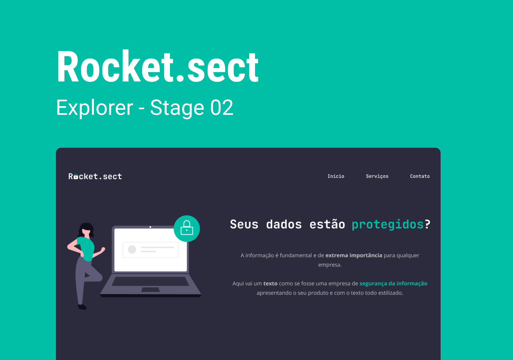

<h1 align="center">Rocket.sect</h1>

  Projeto retirado do programa Explorer, um programa de estudo exclusivo promovido pela Rocketseat para o ensino de tecnologias web.

  <a href="#-layout">Layout</a>&nbsp;&nbsp;&nbsp;|&nbsp;&nbsp;&nbsp;
  <a href="#-aprendizado">Aprendizado</a>&nbsp;&nbsp;&nbsp;|&nbsp;&nbsp;&nbsp;
  <a href="#-projeto">Projeto</a>&nbsp;&nbsp;&nbsp;|&nbsp;&nbsp;&nbsp;
  <a href="#-tecnologias">Tecnologias</a>&nbsp;&nbsp;&nbsp;|&nbsp;&nbsp;&nbsp;
  <a href="#-licença">Licença</a>

 

  

 

  

## 🎨 Layout

Você pode visualizar o layout do projeto através [DESSE LINK](https://www.figma.com/file/EdKjPWjC8ZlbnH4XzTObv2/Explorer/duplicate).

## 📖 Aprendizado

- Aprimorei minhas habilidades com Tailwind CSS;
- Aperfeiçoei meu conhecimento em responsividade dentro do Tailwind CSS;
- Pratiquei a utilização de semântica HTML para estruturar o conteúdo do site de forma significativa e acessível;
- Apliquei meus conhecimentos em layout grid.

## 💻 Projeto

Neste projeto, o objetivo primordial foi a construção de um site voltado para segurança e proteção de dados, empregando conceitos avançados de HTML, CSS, acessibilidade e semântica. Para o desenvolvimento do estilo do site, decidi utilizar a biblioteca Tailwind CSS, que proporciona uma abordagem ágil e eficiente.

## 🧪 Tecnologias

Esse projeto foi desenvolvido com as seguintes tecnologias:

- [HTML](https://developer.mozilla.org/pt-BR/docs/Web/HTML)
- [TailwindCSS](https://tailwindcss.com)
- [NPM](https://www.npmjs.com)
- [Git](https://git-scm.com)
- [Figma](https://www.figma.com)
- [ICONS8](https://icons8.com)

## 📝 Licença

Este projeto está sob a licença MIT. Consulte o arquivo [LICENSE](https://github.com/kauankarvalho/Rocket.sect/blob/main/LICENSE) para obter mais detalhes.
